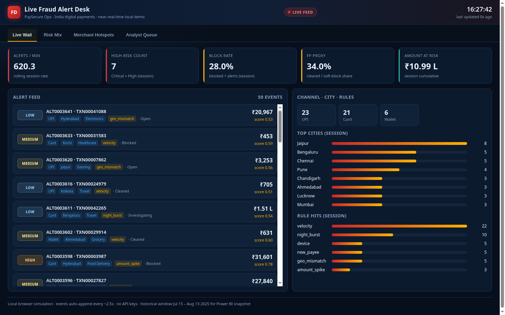
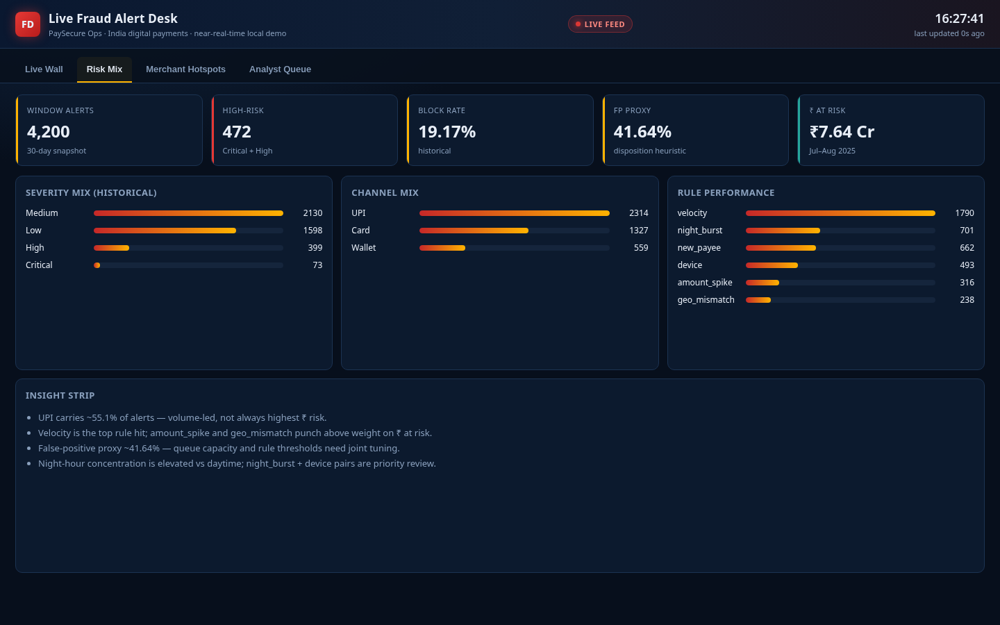
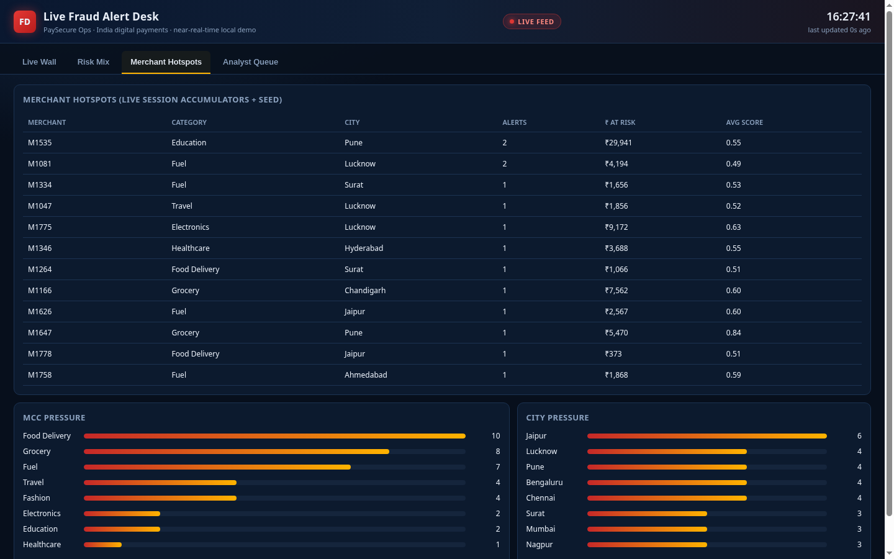
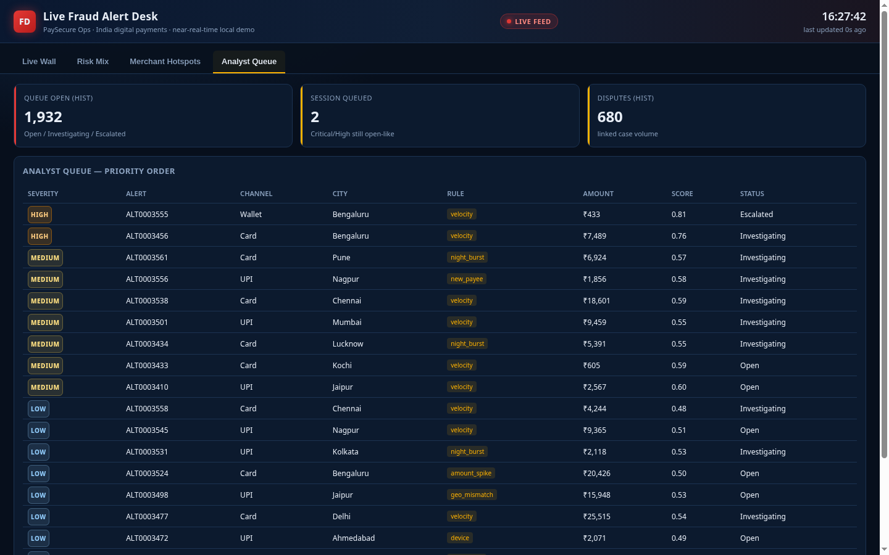

# Live Fraud Alert Desk

Near-real-time **payment fraud / dispute alert wall** for a fictional India digital payments ops team (PaySecure Ops). Historical snapshot analysis in Power BI + a local browser live desk that auto-appends alerts — no cloud streaming service required.

**GitHub:** [tnishant082-dev/live-fraud-alert-desk](https://github.com/tnishant082-dev/live-fraud-alert-desk)

**Walkthrough:** [`artifacts/live-fraud-alert-desk-demo.mp4`](./artifacts/live-fraud-alert-desk-demo.mp4)

---

## Business problem

Digital payments ops need a single place to see **what is firing now**, **how much ₹ is exposed**, and **which rules / merchants / cities** are driving the queue — without waiting for a next-day MIS pack.

Pain this repo addresses:

- Alerts arrive across **UPI / Card / Wallet** with different severity and rule hits
- Analysts lack a live wall + a day/window snapshot they can reconcile
- False positives compete with true blocks for queue time
- Leadership wants clear KPIs: alerts, high-risk, block rate, FP proxy, amount at risk

---

## KPIs (Jul 15 – Aug 13, 2025)

Computed from `data/cleaned/fact_alerts.csv` — matches Excel recon + SQL KPI pack.

| KPI | Value |
|---|---|
| Transactions scored | **48,000** |
| Alerts raised | **4,200** |
| High-risk (Critical + High) | **472** |
| Blocked | **805** (**19.17%** block rate) |
| False-positive proxy | **1,749** (**41.64%**) |
| Amount at risk | **₹7.64 Cr** |
| Alerts / day | **140** |
| UPI share of alerts | **55.1%** |
| Top rule | **velocity** |
| Top city | **Jaipur** |
| Analyst queue (open-like) | **1,932** |
| Disputes | **680** |

---

## Live desk (differentiator)

Open [`live/alert_desk.html`](./live/alert_desk.html) in any browser (offline, zero API keys).

Dark navy fintech ops UI with red / amber alert accents — **not** a Power BI Service stream.

| Tab | What you see |
|---|---|
| **Live Wall** | Auto-appending alert feed (~2.5s), ticking KPI tiles, channel / city / rule bars |
| **Risk Mix** | 30-day severity, channel, rule mix + insight strip |
| **Merchant Hotspots** | Session merchant table + MCC / city pressure |
| **Analyst Queue** | Priority queue sorted Critical → Low |

Optional: `python python/04_live_simulator.py` refreshes `live/events_stream.csv`. The HTML still self-simulates from an embedded seed so a clone works without Python.



---

## Dashboard pages (Power BI snapshot + live screenshots)

### 1. Live Wall
Feed + session KPIs (alerts/min, high-risk, block rate, FP proxy, ₹ at risk).


**Insight:** Velocity and night_burst dominate early session volume; UPI leads count while Card often carries larger ticket sizes.

### 2. Risk Mix
Historical severity / channel / rule breakdown for the Jul–Aug window.



**Insight:** Medium severity is the bulk of volume; Critical is rare but drives escalation. FP proxy ~42% signals threshold and capacity tuning before adding more rules.

### 3. Merchant Hotspots
Merchants, MCC, and cities accumulating risk in-session.



**Insight:** Grocery and Food Delivery lead alert counts; Electronics / Travel repay review on ₹ at risk, not volume alone.

### 4. Analyst Queue
Open / Investigating / Escalated cases in severity order.



**Insight:** Queue depth (~1.9k open-like historically) needs severity SLAs — Critical/High first, Low batched.

**Power BI Desktop:** open [`dashboard/LiveFraudAlertDesk.pbip`](./dashboard/LiveFraudAlertDesk.pbip) for the historical day/window report (CSV-backed semantic model under `data/cleaned` + `data/marts`).

---

## Findings

1. **Velocity is the workhorse rule** (~43% of hits) — good coverage, but pair with amount_spike / geo_mismatch for ₹ impact.
2. **Night concentration is elevated** — night_burst + new device combinations deserve a dedicated night desk playbook.
3. **FP proxy ~42%** — cleared / soft dispositions suggest rule thresholds and merchant allow-lists need joint review with queue capacity.
4. **UPI is volume-led (~55%)**; Card punches above weight on amount — channel-specific block policies beat one global cutoff.
5. Transparent feature blend (`python/03_feature_engineering.py`) is a **baseline for rule tuning**, not a production model claim (F1 ~0.48 at threshold 0.55).

---

## Analysis process

1. Generate deterministic txn / alert / dispute extracts (`python/01_generate_data.py`, seed `20250901`)
2. Clean + mart layers under `data/raw` → `data/cleaned` → `data/marts`
3. EDA + engineered fraud score features (`python/02_eda.py`, `03_feature_engineering.py`)
4. Excel dictionary, cleaning log, KPI reconciliation (`excel/`)
5. SQL KPI + drill-down + recon checks (`sql/`)
6. Power BI `.pbip` snapshot for historical pages (`dashboard/`)
7. Live HTML desk + optional stream simulator (`live/`, `python/04_live_simulator.py`)

---

## Tools

SQL · Python · Excel · Power BI · Dashboarding (live HTML desk)

---

## Repo structure

```text
live/                  alert_desk.html + events seed / stream CSV
dashboard/             LiveFraudAlertDesk.pbip (snapshot report)
data/raw|cleaned|marts CSV extracts and marts
excel/                 dictionary + cleaning log + KPI recon
sql/                   KPI, drill-down, recon queries
python/                generate · EDA · features · live simulator · excel build
screenshots/           live desk tabs
artifacts/             silent demo walkthrough (mp4)
```

---

## How to View

1. Open `live/alert_desk.html` for the near-real-time desk
2. Open `dashboard/LiveFraudAlertDesk.pbip` in Power BI Desktop for the snapshot report
3. Screenshots in `screenshots/` + video in `artifacts/live-fraud-alert-desk-demo.mp4`

```bash
pip install -r requirements.txt
python python/01_generate_data.py   # regenerate CSVs if needed
python python/04_live_simulator.py  # optional CSV ticker
```

---

## Author

**Nishant Tyagi** · [tnishant082-dev](https://github.com/tnishant082-dev)
